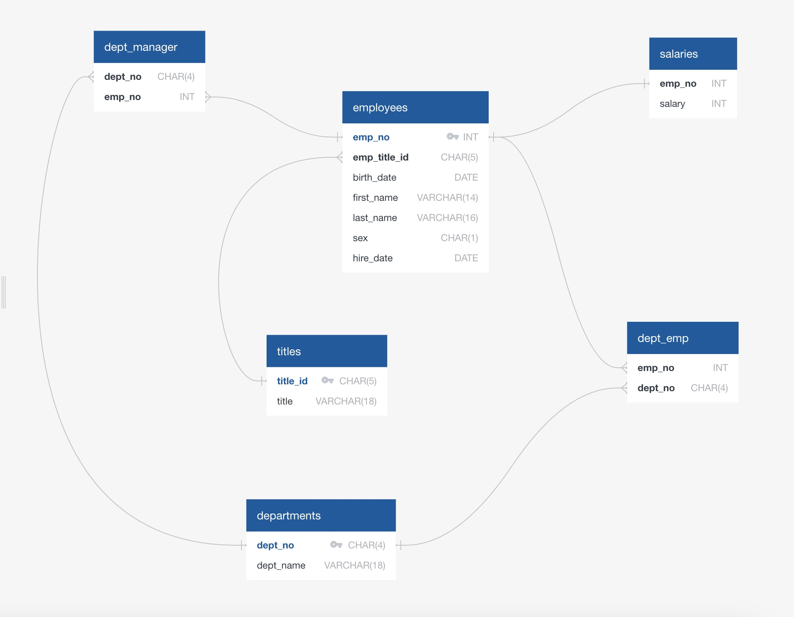

# SQL Challenge - EmployeeSQL  
`Module 9`  
`EdX(2U) & UT Data Analytics and Visualization Bootcamp`  
`Cohort UTA-VIRT-DATA-PT-11-2024-U-LOLC`  
`By Neel Kumar Agarwal`  

## Table of Contents  
1. [Introduction](#introduction)  
2. [Challenge Overview](#challenge-overview)  
3. [Entity Relationship Diagram](#entity-relationship-diagram-erd)  
4. [Summary Breakdowns](#summary-breakdowns)  
5. [Setup and Usage](#setup-and-usage)  
    - [Prerequisites & Instructions](#prerequisites--instructions)  
    - [Directory Structure](#directory-structure)  
    - [Schema](#schema)  
6. [Queries](#queries)  
    - [Query 1](#query-1)  
    - [Query 2](#query-2)  
    - [Query 3](#query-3)  
    - [Query 4](#query-4)  
    - [Query 5](#query-5)  
    - [Query 6](#query-6)  
    - [Query 7](#query-7)  
    - [Query 8](#query-8)  

> [!NOTE]  
> All roleplaying instructions, rubric requirements, and Starter Code (with  
> database and csv's) are provided by 2U/edX as part of their educational  
> package provided with paid entry into the class.  

## Introduction  
It’s been two weeks since I was hired as a new data engineer at Pewlett Hackard (a fictional company).  
My first major task is to do a research project about people whom the company employed during the 1980s  
and 1990s. All that remains of the employee database from that period are six CSV files.  

For this project, I have to design the tables to hold the data from the CSV files, import the CSV files  
into a SQL database, and then answer questions about the data. That is, I'll perform data modeling, data  
engineering, and data analysis, respectively.  


## Challenge Overview  
This challenge is interesting in that the most difficult part was the overall Schema creation and data  
modeling. While the querying was interesting, it didn't challenge my thinking the same was the schema  
creation did, and likely because by doing that work I saved myself a lot of trouble when querying.  

Through the completion of this challenge, I learned how strongly good data modeling depends on context.  
Understanding how the data was decided to be inputted, whether more data will ever come in, and how  
the relationships were envision when the data was originally written. Deciding whether those factors  
are important and should be retained, whether they are erroneous/irrelevant, and what can be changed  
to enhance database efficiency is what was truly challenging for me.


[:arrow_up: Return to TOC](#table-of-contents)  


## Entity Relationship Diagram (ERD)  

### sql-challenge_db DataBase Relationships  

  


[:arrow_up: Return to TOC](#table-of-contents)  


## Summary Breakdowns:  
```
- Repository Creation and Directory Setup  
- CSV/Pandas DataFrame Analysis of Data  
- Entity Relationship Diagram  
   - Conceptual Relationships  
   - Logical Relationships  
   - Physical Relationships  
- Schema Setup/Initialization  
- CSV File Imports (6) Into New Tables  
- SQL Queries  
```  

[:arrow_up: Return to TOC](#table-of-contents)  


## Setup and Usage  
### Prerequisites & Instructions  
- Written in | **SQL:2023 (ISO/IEC 9075:2023)**  
- DBMS used | **PostgreSQL 17.2**  

1. Install PostgreSQL if not already done (ensure version is compatible with *17.2*)  
2. Clone this repository  
3. Create DataBase sql-challenge_db if it doesn't exist  
4. Connection to DataBase should be automatic, create a new `query tool window` or session  
5. Run the `schema.sql` file in a query window to setup/restart tables  
6. Import CSV Files from `sql-challenge_db/EmployeeSQL/data` directory into the corresponding tables  
7. Open the `queries.sql` file in a query window and run block-by-block (be sure to start with the `SET datestyle = 'Postgres, MDY';` line)  

[:arrow_up: Return to TOC](#table-of-contents)  


### Directory Structure  
```  
sql-challenge/  
|  
|—- EmployeeSQL/  
|   |—- data/  
|   |   —- departments.csv  
|   |   -- dept_emp.csv  
|   |   -- dept_manager.csv  
|   |   -- employees.csv  
|   |   -- salaries.csv  
|   |   -- titles.csv  
|   |  
|   |—- queries.sql  
|   |-- schema.sql  
```  
This structure ensures all inputs are organized within their respective folders.  

[:arrow_up: Return to TOC](#table-of-contents)  


### Schema  
**Main tables are: <ins>departments</ins>, <ins>titles</ins>, and <ins>employees</ins>**  
1. <ins>departments</ins>  
   - dept_no CHAR(4)  
   - dept_name VARCHAR(18)  
2. <ins>titles</ins>  
   - title_id CHAR(5)  
   - title VARCHAR(18)  
3. <ins>employees</ins>  
   - emp_no INT  
   - emp_title_id CHAR(5)  
   - birth_date DATE  
   - first_name VARCHAR(14)  
   - last_name VARCHAR(16)  
   - sex CHAR(1)  
   - hire_date DATE  
4. dept_emp  
   - emp_no INT  
   - dept_no CHAR(4)  
5. dept_manager  
   - dept_no CHAR(4)  
   - emp_no INT  
6. salaries  
   - emp_no INT  
   - salary INT  

[:arrow_up: Return to TOC](#table-of-contents)  


## Queries  

### Query 1  

```sql  
-- List the employee number, last name, first name, sex, and salary of each employee
SELECT
   e.emp_no
   ,e.last_name
   ,e.first_name
   ,e.sex
   ,s.salary
FROM
   employees e
INNER JOIN
   salaries s
ON
   e.emp_no = s.emp_no
;
```  

### Query 2  

```sql  
-- List the first name, last name, and hire date for the employees who were hired in 1986.
SELECT
   first_name
   ,last_name
   ,hire_date
FROM
   employees
WHERE
   EXTRACT(YEAR FROM hire_date) = 1986
;
```  

### Query 3  

```sql  
-- List the manager of each department along with their department number, department name, 
-- employee number, last name, and first name.
SELECT
   m.dept_no
   ,d.dept_name
   ,m.emp_no
   ,e.last_name
   ,e.first_name
FROM
   dept_manager m
INNER JOIN
   departments d
ON
   m.dept_no = d.dept_no
INNER JOIN
   employees e
ON
   m.emp_no = e.emp_no
;
```  

### Query 4  

```sql  
-- List the department number for each employee along with that employee’s employee number, 
-- last name, first name, and department name.
SELECT
   de.dept_no
   ,de.emp_no
   ,e.last_name
   ,e.first_name
   ,d.dept_name
FROM
   dept_emp de
INNER JOIN
   employees e
ON
   de.emp_no = e.emp_no
INNER JOIN
   departments d
ON
   de.dept_no = d.dept_no
;
```  

### Query 5  

```sql  
-- List first name, last name, and sex of each employee whose first name is Hercules and whose 
-- last name begins with the letter B.
SELECT
   first_name
   ,last_name
   ,sex
FROM
   employees
WHERE
   first_name = 'Hercules' AND
   last_name LIKE 'B%'
;
```  

### Query 6  

```sql  
-- List each employee in the Sales department, including their employee number, last name, and 
-- first name.
SELECT
   d.emp_no
   ,e.last_name
   ,e.first_name
FROM
   dept_emp d
INNER JOIN
   employees e
ON
   d.emp_no = e.emp_no
WHERE 
   d.dept_no = (
   SELECT dept_no
   FROM departments
   WHERE dept_name = 'Sales')
ORDER BY d.emp_no ASC
;
```  

### Query 7  

```sql  
-- List each employee in the Sales and Development departments, including their employee number, 
-- last name, first name, and department name.
SELECT
   de.emp_no
   ,e.last_name
   ,e.first_name
   ,d.dept_name
FROM
   dept_emp de
INNER JOIN
   employees e
ON
   de.emp_no = e.emp_no
INNER JOIN
   departments d
ON
   de.dept_no = d.dept_no
WHERE
   d.dept_name = 'Sales' OR
   d.dept_name = 'Development'
;
```  

### Query 8

```sql  
-- List the frequency counts, in descending order, of all the employee last names 
-- (that is, how many employees share each last name).
SELECT
   last_name
   ,COUNT(last_name) frequency
FROM
   employees
GROUP BY last_name
ORDER BY frequency DESC
;
```  

[:arrow_up: Return to TOC](#table-of-contents)  